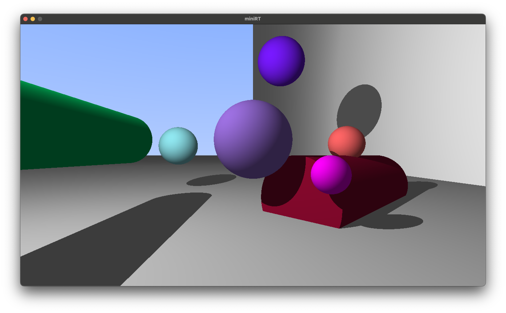
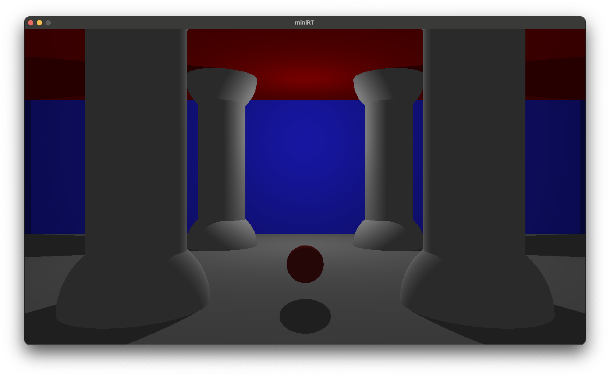
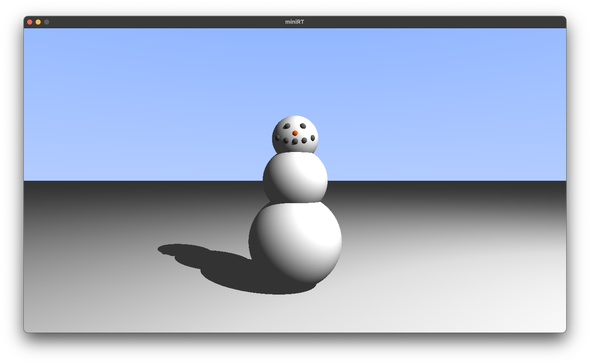
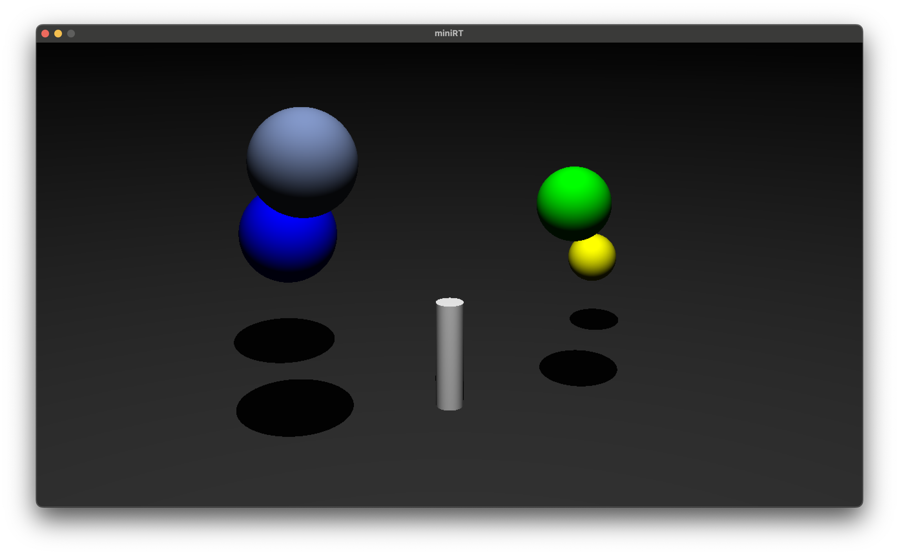

# miniRT
A simple Ray-Tracing program written in C and capable of rendering scenes composed of simple geometric shapes. It uses [MLX](https://github.com/codam-coding-college/MLX42) Codam's alternative to the 42 Network's graphical library and [LIBFT](https://github.com/urbanobazz/Libft) my own version of the C standard library.



# Usage

- Compile the code using make:
```bash
/> make
```
- Run the executable with one of the scenes located at /scenes
```bash
/> ./miniRT scenes/multi-object.rt
```

- Feel free to play around and change the parameters in the .rt files to see how it affects the final render. Here are a couple things you can do:

1. You can change object's colors, location, size, orientation or just add new ones.

2. You can change the camera's Field of View, location and orientation.

3. Play with ambient light intensity, to see how it affects the scenes's contrast.

4. You can move the light around the scene and get some cool shadow effects. Unfortunately the program only supports one spotlight with the white color, I might add support for multiple/colorful ones in the future.

5. Use your imagination!

# A couple of examples




